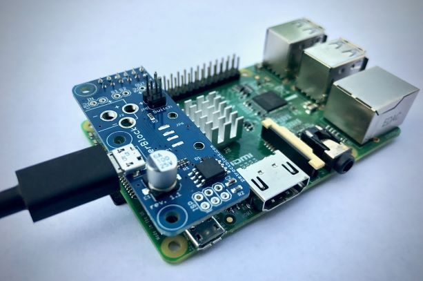

# PowerBlock-Emteria

The [PowerBlock](https://blog.petrockblock.com/powerblock/) is an extension board for the Raspberry Pi. The key feature of the PowerBlock is a safe power button functionality together with LED status indication.

This repository contains the installer for the [PowerBlock](https://blog.petrockblock.com/powerblock/) driver for [Emteria](https://emteria.com/), an Android distribution. 

## Pre-Requisites for Driver Installation

1. The installation script needs the __Android SDK Platform Tools__. You can download them from [https://developer.android.com/studio/releases/platform-tools](https://developer.android.com/studio/releases/platform-tools).

2. When you have installed the SDK Platform Tools, you need to set the variable `ADB_TOOL` in the file `installDriver.bat` to the correct path of your ADB installation.

3. Furtheremore, you need to set the variable `IP_OF_DEVICE`in the file `ìnstallDriver.bat` to the correct IP address of your device.

4. You need to enable 'Enable ADB over Ethernet' in your Emteria installation: Open 'Settings', 'Emteria'. Activate the option 'Enable ADB over Ethernet'.

## Installation Instructions

1. If you have not done so already, make sure to do all the described steps from the Section __"Pre-Requesites"__ above.

2. Execute the batch file `installDriver.bat`.

3. Shutdown your Emteria device and connect the PowerBlock with the Raspberry Pi. Make sure to also connect the USB power to the PowerBlock.

4. You should now be able to start and shutdown your Emteria device with the PowerBlock.

Good luck with your project!